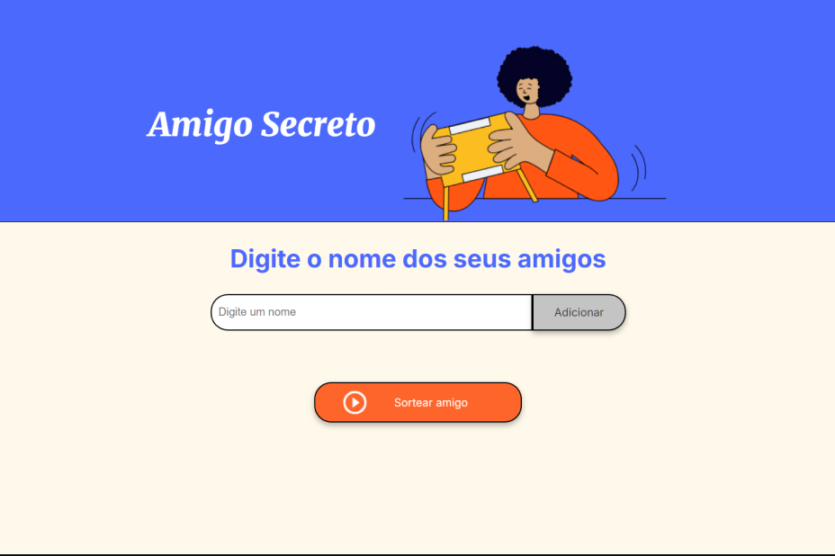
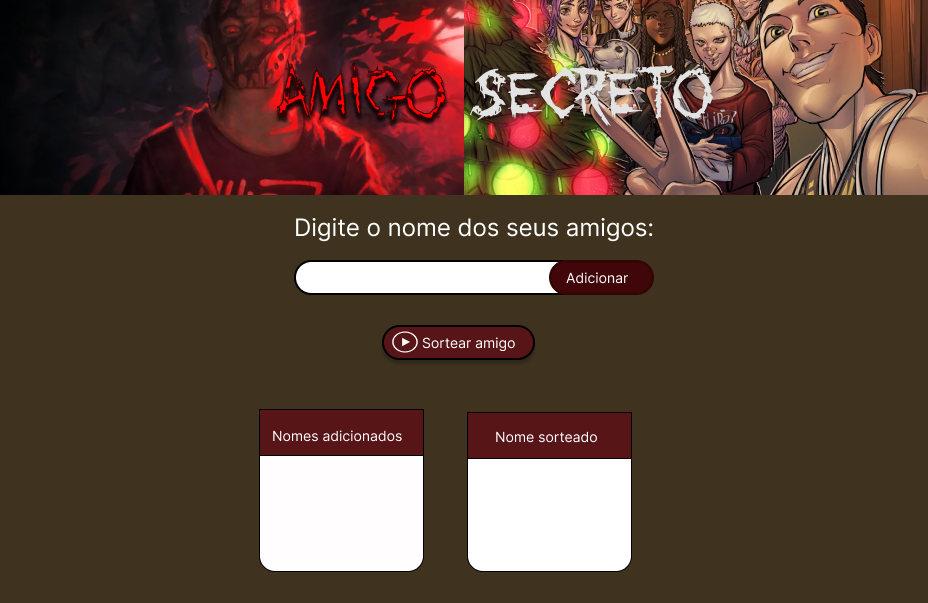
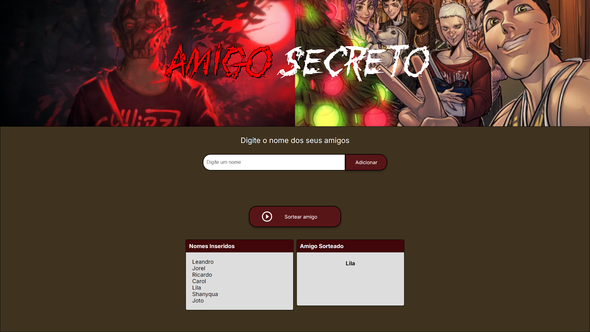
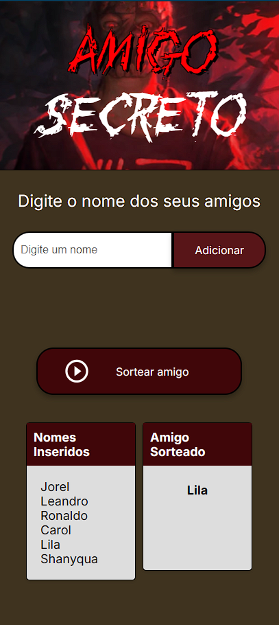

# 🎁 Amigo Secreto

Projeto desenvolvido durante o curso **Iniciante em Programação G8 - ONE** da Alura. O objetivo é praticar lógica de programação com HTML, CSS e JavaScript, criando um sistema para sortear nomes de amigos.

---

## 🔗 Link do Projeto

Acesse o projeto online: [Amigo Secreto](https://amigo-secreto-chi-teal.vercel.app/)  

---

## 💻 Tecnologias

- HTML
- CSS
- JavaScript
  
---

## 🛠️ Funcionalidades

- **Adicionar Amigos**: Insira nomes na lista.
- **Listar Amigos**: Veja todos os nomes adicionados.
- **Sortear Amigo**: Sorteie um nome aleatório da lista.

---

## 🎨 Modificações no Layout

Personalizei o layout original para refletir algo que eu gosto, tornando o projeto único e com a minha cara. Aqui estão as principais mudanças:

### Layout Original

### Protótipo no Figma
| Desktop | Mobile |
|---------|--------|
|  |  |

### Resultado Final
| Desktop | Mobile |
|---------|--------|
|  |  |
---

## 📄 Licença

MIT License. Consulte o arquivo [LICENSE](LICENSE) para detalhes.

